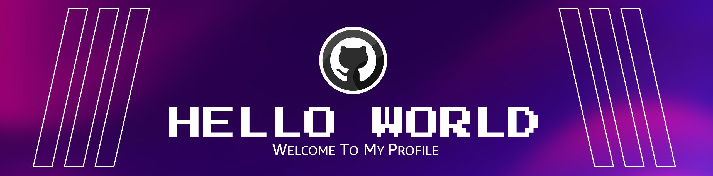

<!--Banner-->

<!--Night Owl image-->

  

<!--Header Name-->
#  I'M Dimuthu Wayaman! 
*(Designer / Developer)*
  

<!--Start Intro-->               

I’m a Flutter Developer and AI Enthusiast with a strong passion for mobile app development, Riverpod, Clean Architecture, Firebase, JavaScript, and creative AI integration in education, entertainment, and smart tools. 

- ✨ Student of life :)
- 🌱 I’m currently learning many things, I believe that everyday is a learning opportunity.
- 💁‍♂️ Designer and Mobile App Developer at [Globevik](https://globevik.com/)
- 🏙 Developer of [Beggar](https://playbeggar.online/), a multiplayer card game with voice chat and custom rules.
- ❤ Contributing to Open Source.
<!--End Intro-->

<!--Profile Count Badge-->

  

---

<!--Languages and Tools Section-->       
<h2 align="center">Tᴇᴄʜ sᴛᴀᴄᴋ & Lᴀᴛᴇsᴛ ʙʟᴏɢs</h2> 
<picture>
  <source media="(prefers-color-scheme: dark)" srcset="./Skills_Animation_Dark.gif">
  <source media="(prefers-color-scheme: light)" srcset="./Skills_Animation_White.gif">
  
</picture>
 

<h3 align="left">Current Learning</h3>
<ul align="left">
  <li>Deepening my knowledge in AI integration and building intelligent features into Flutter apps.</li>
  <li>Experimenting with WebRTC, Socket communication, and cloud deployments.</li>
  <li>Exploring Flutter Riverpod and Clean Architecture for scalable mobile development.</li>
</ul>
  
<h3 align="left">Latest Blog Posts</h3>
<ul align="left">
  <li><a href="https://dev.to/dev_kiran/storyblok-mcp-server-let-ai-agents-manage-your-content-3jaa">🔥Beggar Card Game: Launched a real-time multiplayer game with voice chat & custom roles</a></li>
  <li><a href="https://dev.to/dev_kiran/pulstack-deploy-your-static-site-to-s3-or-github-in-1-min-5cin">🔥 Patta Wadan App: Created a Sinhala-English meme app with daily jokes and motivation</a></li>
  <li><a href="https://dev.to/dev_kiran/i-tried-out-qodos-new-embed-model-qodo-embed-1-40h5">🔥O-Level Maths App: Created an interactive study tool with daily practice questions, tutorials, and tips for mastering O-Level Mathematics</a></li>
</ul>
 
 
 
 

<!--Trophies Section-->   
<h2 align="center">🏆 Gɪᴛʜᴜʙ Tʀᴏᴘʜɪᴇs 🏆</h2>

  <a href="https://github.com/DimuthuWayaman">
    <picture>
      <source media="(prefers-color-scheme: dark)" srcset="https://github-profile-trophy.vercel.app/?username=DimuthuWayaman&no-bg=true&row=2&column=6&margin-w=20&margin-h=20&theme=monokai">
      <source media="(prefers-color-scheme: light)" srcset="https://github-profile-trophy.vercel.app/?username=DimuthuWayaman&no-bg=true&row=2&column=6&margin-w=20&margin-h=20">
      
    </picture>
  </a>

 

<!--Github stats Table--> 
<h2 align="center">📊 Gɪᴛʜᴜʙ Sᴛᴀᴛs 📊</h2>

<table width="100%">
  <tr>
    <td width="50%">
      <h3 align="center"><strong>Gɪᴛʜᴜʙ Sᴛᴀᴛs</strong></h3>
      

        
      

    </td>
    <td width="50%">
      <h3 align="center"><strong>Sᴛʀᴇᴀᴋ Sᴛᴀᴛs</strong></h3>
      

        
      

    </td>
  </tr>
  <tr>
    <td width="50%">
      <h3 align="center"><strong>Lᴀᴛᴇsᴛ Pʀᴏᴊᴇᴄᴛ</strong></h3>
      

        
      

    </td>
    <td width="50%">
      <h3 align="center"><strong>Tᴏᴘ Cᴏɴᴛʀɪʙᴜᴛɪᴏɴs</strong></h3>
      

        
      

    </td>
  </tr>
</table>
 

<!--Contribution Graph-->
<h2 align="center">📈 Cᴏɴᴛʀɪʙᴜᴛɪᴏɴ Gʀᴀᴘʜ 📈</h2>

    

---

<!--Dynamic Quote card updates everyday at 12 PM--> 
<h2 align="center">🌟 Tʜᴏᴜɢʜᴛ ᴏғ ᴛʜᴇ Dᴀʏ 🌟</h2>

<!--STARTS_HERE_QUOTE_CARD-->

    

<!--ENDS_HERE_QUOTE_CARD-->

<!--Contact Section--> 

<h2 align="center">🤝 Cᴏɴɴᴇᴄᴛ Wɪᴛʜ Mᴇ 🤝 </h2>

  

 

<!--Buy me a coffee-->
<!--div align="center">

</div-->

<!--Footer--> 

  

